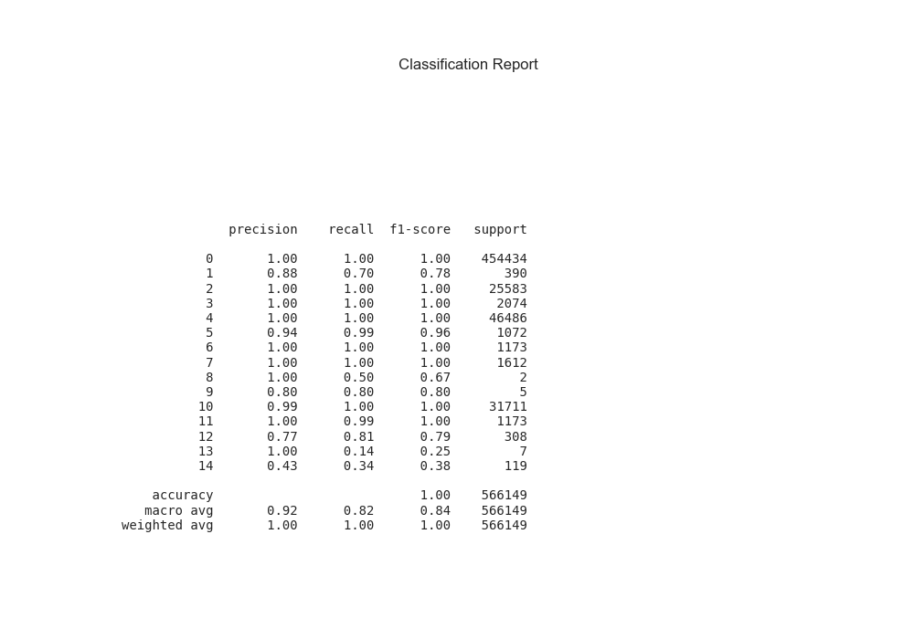
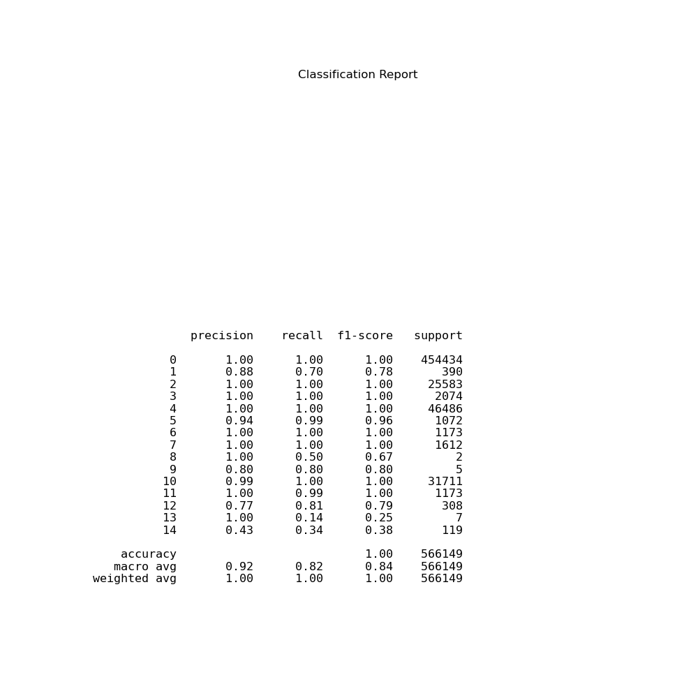
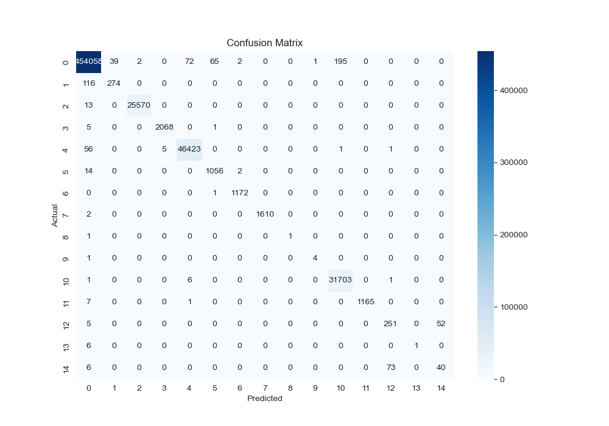
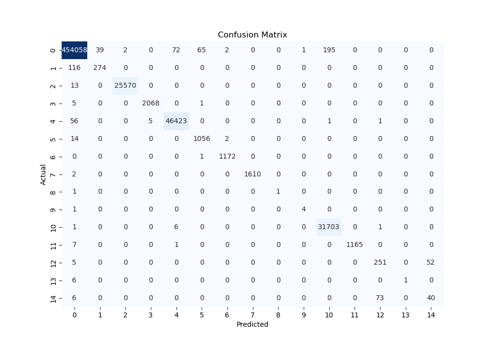
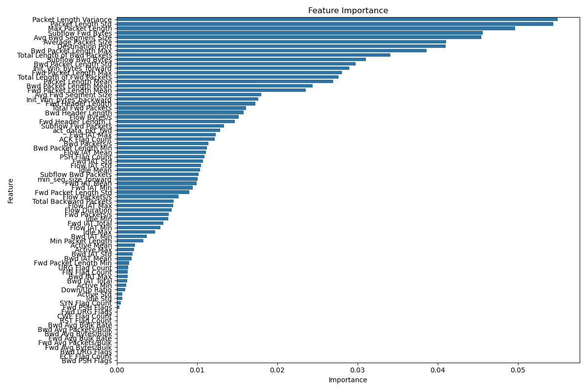

# 网络流量分类与异常检测算法

## 项目概述

本项目使用 **随机森林算法** 对网络流量数据(**[CICIDS2017]([CIC-IDS2017_数据集-阿里云天池](https://tianchi.aliyun.com/dataset/146744))**)进行分类和异常检测。通过分析特征重要性，我们筛选出对分类影响较大的前 30 个特征，并利用这些特征训练分类模型。该项目分为数据预处理、特征分析、模型训练和评估四个主要部分。

## 数据介绍

CICIDS2017数据集包含良性和最新的常见攻击，与真实的现实世界数据（PCAPs）相类似。它还包括使用CICFlowMeter进行网络流量分析的结果，并根据时间戳、源和目的IP、源和目的端口、协议和攻击来标记流量（CSV文件）。此外，还提供了提取的特征定义。 生成真实的背景流量是我们建立这个数据集的首要任务。我们使用了我们提出的B-Profile系统（Sharafaldin, et al. 2016）来描述人类互动的抽象行为并生成自然的良性背景流量。对于这个数据集，我们建立了基于HTTP、HTTPS、FTP、SSH和电子邮件协议的25个用户的抽象行为。

数据采集期从2017年7月3日星期一上午9点开始，到2017年7月7日星期五下午5点结束，共5天。

周一是正常的一天，只包括良性流量。

在星期二、星期三、星期四和星期五的上午和下午实施的攻击包括蛮力FTP、蛮力SSH、DoS、Heartbleed、Web攻击、渗透、Botnet和DDoS。

在我们最近的数据集评估框架中（Gharib等人，2016），我们确定了建立一个可靠的基准数据集所需的11个标准。以前的IDS数据集都无法涵盖这11个标准。在下文中，我们简要概述了这些标准。

完整的网络配置。一个完整的网络拓扑结构包括调制解调器、防火墙、交换机、路由器和各种操作系统，如Windows、Ubuntu和Mac OS X。

完整的流量。通过拥有一个用户分析代理和受害者网络中的12台不同机器以及来自攻击网络的真实攻击。

标记的数据集。第4节和表2显示了每一天的良性和攻击标签。另外，攻击时间的细节将在数据集文件中公布。

完整的交互性。如图1所示，我们通过两个不同的网络和互联网通信覆盖了内部局域网内部和之间。

完整的捕获。因为我们使用的是镜像端口，比如窃听系统，所有的流量都被捕获并记录在存储服务器上。

可用的协议。提供了所有常见的可用协议，如HTTP、HTTPS、FTP、SSH和电子邮件协议的存在。

攻击的多样性。包括基于2016年McAfee报告的最常见的攻击，如该数据集中涵盖的基于Web的攻击、暴力攻击、DoS、DDoS、渗透、心脏出血、机器人和扫描。

异质性。在攻击执行期间，从主交换机和内存转储以及所有受害者机器的系统调用中捕获网络流量。

特征集。使用CICFlowMeter从生成的网络流量中提取了80多个网络流量特征，并将网络流量数据集作为CSV文件交付。参见我们的PCAP分析器和CSV生成器。

元数据。完整地解释了数据集，包括时间，攻击，流量和发表的论文中的标签。

完整的研究论文概述了数据集的细节和其基本原理。

## 项目主要的机器学习内容包括：

#### 1. 数据预处理

数据预处理是机器学习流程中的第一步，主要内容包括：

- **数据清洗**：填补缺失值，删除或替换无效值（如 `inf` 或 `NaN`）。
- **特征编码**：将标签转换为数值形式，以便模型能够识别和处理分类信息。
- **特征标准化**：将数值特征缩放到相似的尺度，以避免特征间量级差异导致的模型偏差。
- **数据划分**：将数据集划分为训练集和测试集，以便进行模型训练和评估。

#### 2. 特征选择

特征选择是提升模型性能的重要步骤，主要内容包括：

- **特征重要性分析**：使用训练数据训练初始模型，提取特征重要性分数，从而识别在分类中最具影响力的特征。
- **筛选特征**：根据特征重要性分数选出前30个重要特征，简化模型，减少计算成本，同时提高模型的泛化能力。

#### 3. 模型选择与训练

本项目选用了 **随机森林算法** 来进行分类，主要内容包括：

- **模型选择**：随机森林是一种基于决策树的集成方法，具有较好的抗过拟合能力和高维数据处理能力，适合用于本项目的多类别网络流量分类任务。
- **模型训练**：使用预处理后的数据集训练随机森林模型。训练过程中，调用所有 CPU 核心以加速模型构建。
- **参数设定**：通过调整随机森林中的参数（如决策树数量 `n_estimators`、随机种子 `random_state` 等）来平衡模型的精度和效率。

#### 4. 模型评估

模型评估是验证模型性能的关键步骤，主要内容包括：

- **分类报告**：生成模型在测试集上的精度、召回率、F1 分数等指标，评估模型在不同类别上的表现。
- **混淆矩阵**：通过混淆矩阵观察模型的分类情况，包括正确分类和误分类情况，为模型优化提供指导。
- **模型准确率**：计算整体准确率，评估模型的总体性能。

#### 5. 结果可视化

结果可视化有助于直观理解模型性能，主要内容包括：

- **特征重要性图**：绘制特征重要性排名图，显示前30个重要特征，帮助理解哪些特征对分类最具影响。
- **混淆矩阵图**：将混淆矩阵转换为热力图，直观呈现不同类别间的分类效果。
- **分类报告图**：将分类报告保存为图像，以便于观察和分析各项评估指标。

## 机器学习的目标：

### 构建高效的网络流量分类模型

通过机器学习技术，尤其是随机森林分类算法，构建一个高效、准确的模型，能够对网络流量数据进行自动分类，并识别潜在的异常行为或攻击类型。具体来说，该模型应当具备以下能力：

1. **准确识别正常与异常流量**：
   - 模型能够在海量网络流量数据中，准确地区分正常流量与异常流量（如潜在的攻击行为）。
   - 减少误报和漏报，提高模型在实际应用中的可靠性。
2. **多类别分类**：
   - 识别不同类型的攻击（如 DoS、扫描、恶意软件等），而不仅仅是检测到异常。
   - 提供详细的分类信息，以帮助网络安全分析人员采取合适的应对措施。
3. **快速处理和预测**：
   - 模型能够在合理的时间内处理大量的网络流量数据，以适应实际应用中的实时或近实时需求。
   - 通过优化特征选择和模型参数，使得模型在保证高准确率的同时，最大限度地提升效率。
4. **提升网络安全防护能力**：
   - 借助机器学习模型的自动化处理能力，提升网络安全系统的防护水平，减少对人工分析的依赖。
   - 通过对历史流量数据的学习，提高模型对新型攻击模式的检测能力，并提供有效的预警机制。

### 总体目标

通过实现上述目标，项目旨在为网络流量分析和网络安全监测提供一个自动化、智能化的解决方案，提高整体的网络安全防护能力和响应速度，降低潜在的网络威胁带来的风险。

## 项目结构

```bash
machine-learning-algorithm/
│
├── data/                                   # 数据文件夹
│   ├── CICIDS2017/                         # 原始数据集
│   │   ├── Friday-WorkingHours-Afternoon-DDos.pcap_ISCX.csv
│   │   ├── Friday-WorkingHours-Afternoon-PortScan.pcap_ISCX.csv
│   │   ├── Friday-WorkingHours-Morning.pcap_ISCX.csv
│   │   ├── Monday-WorkingHours.pcap_ISCX.csv
│   │   ├── Thursday-WorkingHours-Afternoon-Infilteration.pcap_ISCX.csv
│   │   ├── Thursday-WorkingHours-Morning-WebAttacks.pcap_ISCX.csv
│   │   ├── Tuesday-WorkingHours.pcap_ISCX.csv
│   │   ├── Wednesday-workingHours.pcap_ISCX.csv
│   ├── processed/                          # 处理后的数据文件
│   │   └── X_test.csv                      # 测试集特征数据
│   │   └── X_train.csv                     # 训练集特征数据 
│   │   └── y_test.csv                      # 测试集标签数据
│   │   └── y_train.csv                     # 训练集标签数据 
│
├── notebooks/                              # Jupyter notebooks文件夹
│   ├── preprocess_data.jpynb               # 数据预处理代码
│   ├── feature_importance.jpynb            # 特征重要性分析
│   ├── train_mode.jpynb                    # 训练模型（全特征）
│   ├── train_model(30).jpynb               # 训练模型（前30个特征）
│   └── evaluate_model.jpynb                # 模型评估与可视化
│
├── scripts/                                # Python脚本文件夹
│   ├── preprocess_data.py                  # 数据预处理脚本
│   ├── feature_importance.py               # 特征重要性分析脚本
│   ├── train_model.py                      # 训练模型脚本
│   └── evaluate_model.py                   # 模型评估脚本
│
├── models/                                 # 模型保存文件夹
│   ├──random_forest_model_top30.pkl        # 仅使用前30个特征训练的随机森林模型
│   └── random_forest_model.pkl             # 训练全特征的随机森林模型
│
├── results/                                # 实验结果文件夹
│   ├── classification_report.png           # 分类报告图片（全特征模型）
│   ├── classification_report1.png          # 分类报告图片（前30特征模型）
│   ├── classification_report1.txt          # 分类报告文本（前30特征模型）
│   ├── confusion_matrix.png                # 混淆矩阵图片（全特征模型）
│   ├── confusion_matrix1.png               # 混淆矩阵图片（前30特征模型）
│   ├── feature_importance.csv              # 特征重要性数据
│   └── feature_importance.png              # 特征重要性图
│
├── README.md                               # 项目说明文档
└──requirements.txt                        # 项目依赖文件
```

## 依赖项安装

在运行本项目之前，请确保已经安装了所有必要的 Python 库。可以使用以下命令安装项目依赖项：

```bash
pip install -r requirements.txt
```

`requirements.txt` 文件包含了项目所需的主要依赖库：

```makefile
pandas==1.3.3          # 用于数据操作和分析
scikit-learn==0.24.2   # 机器学习库，包含模型训练、评估和特征选择
matplotlib==3.4.3      # 用于数据可视化的图表绘制
seaborn==0.11.2        # 数据可视化库，绘制统计图
joblib==1.0.1          # 用于模型的保存与加载
```

## 运行步骤

### 方式一：通过 Python 脚本运行项目

项目中的 Python 脚本提供了一个自动化的流程，按照以下步骤运行整个项目：

#### 1.数据预处理 (preprocess.py)

##### 1. 导入库

```python
import os
import pandas as pd
from sklearn.preprocessing import StandardScaler, LabelEncoder
from sklearn.model_selection import train_test_split
```

解释：引入了所需的库：

- `os`：用于处理文件路径和文件操作。
- `pandas`：用于数据处理，方便读取和处理数据集。
- `StandardScaler` 和 `LabelEncoder`：来自 `sklearn.preprocessing`，用于特征标准化和标签编码。
- `train_test_split`：用于将数据集分割为训练集和测试集。

##### 2. 定义 `load_and_merge_csv` 函数

```python
def load_and_merge_csv(folder_path):
    csv_files = [f for f in os.listdir(folder_path) if f.endswith('.csv')]
    combined_data = pd.DataFrame()

    for file in csv_files:
        file_path = os.path.join(folder_path, file)
        print(f"正在读取文件: {file}")
        data = pd.read_csv(file_path)
        data.columns = data.columns.str.strip()  # 去除列名中的空格
        combined_data = pd.concat([combined_data, data], ignore_index=True)

    return combined_data

```

解释：

- 该函数读取指定文件夹中的所有 CSV 文件，并将其合并为一个 DataFrame。
- `os.listdir(folder_path)` 获取文件夹中的所有文件，通过条件 `if f.endswith('.csv')` 筛选出 CSV 文件。
- `pd.concat([combined_data, data], ignore_index=True)` 将各文件的数据拼接到一起，`ignore_index=True` 确保索引重新编号。
- `data.columns.str.strip()` 去除列名中的多余空格，避免因不一致的列名导致的问题。

##### 3. 定义 `handle_missing_values` 函数

```python
def handle_missing_values(data):
    numeric_columns = data.select_dtypes(include=['number']).columns  # 筛选数值列
    data[numeric_columns] = data[numeric_columns].fillna(data[numeric_columns].median())  # 填充数值列的缺失值
    return data

```

解释：

- 该函数处理数据中的缺失值，仅对数值列进行操作。
- `data.select_dtypes(include=['number']).columns` 获取数据中的数值列。
- `data[numeric_columns].fillna(data[numeric_columns].median())` 将数值列的缺失值填充为该列的中位数，以减少异常值的影响。

##### 4. 定义 `handle_invalid_values` 函数

```python
def handle_invalid_values(data):
    data = data.replace([float('inf'), float('-inf')], float('nan'))
    data = data.fillna(0)  # 填充NaN
    return data
```

解释：

- 该函数替换数据中的无效值，如正无穷和负无穷，将它们替换为 NaN。
- `data.replace([float('inf'), float('-inf')], float('nan'))`：将无穷值替换为 NaN 便于进一步处理。
- `data.fillna(0)` 将 NaN 填充为 0，避免模型训练中出现错误。

##### 5. 定义 `encode_labels` 函数

```python
def encode_labels(data, label_column='Label'):
    if label_column in data.columns:
        label_encoder = LabelEncoder()
        data[label_column] = label_encoder.fit_transform(data[label_column])
        print(f"已对标签 '{label_column}' 进行编码。")
        return data, label_encoder
    else:
        print(f"警告：数据中没有找到 '{label_column}' 列，跳过标签编码。")
        return data, None

```

**解释：**

- 该函数对标签列（默认为 `Label`）进行编码，将类别标签转换为数字形式，适用于机器学习模型。
- `LabelEncoder` 创建标签编码器对象，用 `fit_transform` 将标签列转换为数字。
- `if label_column in data.columns` 判断标签列是否存在，防止缺少标签列时出错。

##### 6. 定义 `scale_features` 函数

```python
def scale_features(data, feature_columns):
    scaler = StandardScaler()
    data[feature_columns] = scaler.fit_transform(data[feature_columns])
    return data, scaler

```

解释：

- 该函数使用标准化方法对数值特征列进行缩放，使得每列的均值为 0，标准差为 1，减少特征的数量级差异对模型的影响。
- `StandardScaler` 对特征列进行标准化。

##### 7. 定义 `split_data` 函数

```python
def split_data(data, label_column='Label', test_size=0.2):
    X = data.drop(columns=[label_column])
    y = data[label_column]
    X_train, X_test, y_train, y_test = train_test_split(X, y, test_size=test_size, random_state=42)
    return X_train, X_test, y_train, y_test

```

解释：

- 该函数将数据分为训练集和测试集。
- `data.drop(columns=[label_column])` 移除标签列以获取特征数据 `X`，`y` 为标签数据。
- `train_test_split` 按 8:2 比例划分数据集（80% 用于训练，20% 用于测试）。

##### 8. 主程序逻辑

```python
if __name__ == "__main__":
    folder_path = '../data/CICIDS2017/'  # 确保路径正确
    output_dir = '../data/processed'

    combined_data = load_and_merge_csv(folder_path)

    # 处理缺失值和无效值
    combined_data = handle_missing_values(combined_data)
    combined_data = handle_invalid_values(combined_data)

    feature_columns = combined_data.select_dtypes(include=['number']).columns  # 仅选择数值列进行标准化

    # 标签编码
    combined_data, label_encoder = encode_labels(combined_data)

    # 如果存在 'Label' 列则继续处理
    if label_encoder is not None:
        combined_data, scaler = scale_features(combined_data, feature_columns)

        # 分割数据集
        X_train, X_test, y_train, y_test = split_data(combined_data)

        # 保存处理后的数据
        os.makedirs(output_dir, exist_ok=True)
        X_train.to_csv(f'{output_dir}/X_train.csv', index=False)
        y_train.to_csv(f'{output_dir}/y_train.csv', index=False)
        X_test.to_csv(f'{output_dir}/X_test.csv', index=False)
        y_test.to_csv(f'{output_dir}/y_test.csv', index=False)
        print("数据预处理完成并保存！")
    else:
        print("由于缺少 'Label' 列，跳过预处理。")

```

**解释**：

1. 设置数据文件夹路径 `folder_path` 和保存处理数据的文件夹 `output_dir`。
2. 调用 `load_and_merge_csv(folder_path)` 读取并合并 CSV 数据。
3. 处理缺失值和无效值，确保数据完整性。
4. 确定数值列并对其进行标准化。
5. 如果标签列存在，编码标签列并进行数据分割，将数据集划分为训练集和测试集。
6. 将训练集和测试集的数据分别保存为 `X_train.csv`、`y_train.csv`、`X_test.csv` 和 `y_test.csv`。

- **运行结果**：
  - 经过此步骤后，数据已清理完毕，处理后数据集已保存到 `../data/processed` 文件夹中，可供模型训练使用。

#### 2.特征选择 (feature_importance.py)

##### 1. 导入库

```python
import os
import pandas as pd
from sklearn.ensemble import RandomForestClassifier
import matplotlib.pyplot as plt
import seaborn as sns
```

**解释**：引入所需的库：

- `os`：用于文件路径操作。
- `pandas`：用于数据处理，方便加载数据。
- `RandomForestClassifier`：来自 `sklearn.ensemble`，用于训练随机森林模型以计算特征重要性。
- `matplotlib.pyplot` 和 `seaborn`：用于数据可视化，将特征重要性可视化。

##### 2. 定义 `load_data` 函数

```python
def load_data(data_dir):
    X_train = pd.read_csv(os.path.join(data_dir, 'X_train.csv'))
    y_train = pd.read_csv(os.path.join(data_dir, 'y_train.csv')).values.ravel()
    return X_train, y_train

```

解释：

- 该函数从指定的 `data_dir` 文件夹中加载训练数据集。
- `pd.read_csv` 读取 `X_train.csv` 和 `y_train.csv`，分别代表特征和标签数据。
- `values.ravel()` 将 `y_train` 转换为一维数组，确保格式正确，以便在模型训练时不会出错。

##### 3. 定义 `feature_importance_analysis` 函数

```python
def feature_importance_analysis(X_train, y_train, output_dir):
    # 使用随机森林来计算特征重要性，启用所有 CPU 核心
    model = RandomForestClassifier(n_estimators=100, random_state=42, n_jobs=-1)  # n_jobs=-1 启用所有 CPU 核心
    model.fit(X_train, y_train)

    # 获取特征重要性
    importance = model.feature_importances_
    feature_names = X_train.columns
    feature_importance_df = pd.DataFrame({'feature': feature_names, 'importance': importance})
    feature_importance_df = feature_importance_df.sort_values(by='importance', ascending=False)

    # 输出特征重要性数据到CSV
    os.makedirs(output_dir, exist_ok=True)
    feature_importance_df.to_csv(os.path.join(output_dir, 'feature_importance.csv'), index=False)

    # 可视化特征重要性
    plt.figure(figsize=(12, 8))
    sns.barplot(x='importance', y='feature', data=feature_importance_df)
    plt.title('Feature Importance')
    plt.xlabel('Importance')
    plt.ylabel('Feature')
    plt.tight_layout()
    plt.savefig(os.path.join(output_dir, 'feature_importance.png'))
    plt.close()
    print("Feature importance analysis completed and saved.")

```

解释：

- 该函数使用随机森林模型计算特征重要性并将其可视化。
- `RandomForestClassifier(n_estimators=100, random_state=42, n_jobs=-1)`：创建一个随机森林模型，使用 100 棵决策树，`n_jobs=-1` 启用所有 CPU 核心加速计算。
- `model.fit(X_train, y_train)`：训练模型，使用训练数据来计算特征的重要性。
- `model.feature_importances_`：提取特征重要性分数，为每个特征提供其在预测中的相对重要性。
- 创建 `feature_importance_df` 数据框来存储特征名称和重要性分数，并按重要性降序排序。
- `feature_importance_df.to_csv`：将特征重要性数据保存为 `feature_importance.csv` 文件，便于分析和记录。
- 可视化特征重要性，使用 `sns.barplot` 绘制特征重要性条形图，将图像保存到 `feature_importance.png`。

##### 4. 主程序逻辑

```python
if __name__ == "__main__":
    data_dir = os.path.abspath('../data/processed')  # 确保指向预处理后的数据文件夹
    output_dir = os.path.abspath('../results')  # 指向存储结果的文件夹

    # 加载数据
    print("Loading preprocessed data for feature importance analysis...")
    X_train, y_train = load_data(data_dir)

    # 分析特征重要性
    print("Analyzing feature importance...")
    feature_importance_analysis(X_train, y_train, output_dir)

    print("Feature importance analysis completed successfully.")

```

解释：

- 设置数据文件夹路径 `data_dir` 和保存结果的文件夹 `output_dir`。
- 调用 `load_data` 加载训练数据。
- 调用 `feature_importance_analysis` 函数进行特征重要性分析。
- 经过此步骤后，特征重要性分析的结果将被保存为 CSV 文件和 PNG 图像，分别记录在 `feature_importance.csv` 和 `feature_importance.png` 文件中。

#### 3.训练模型(train_model.py)

#### 代码块 1：训练所有特征的代码

##### 1.**导入必要的库**：

```python
import pandas as pd
from sklearn.ensemble import RandomForestClassifier
import joblib
import os
```

解释：

- `pandas` 用于数据处理。
- `RandomForestClassifier` 是用于模型训练的随机森林算法。
- `joblib` 用于保存训练好的模型。
- `os` 用于文件和路径管理。

##### 2.定义**`load_preprocessed_data`函数**：

```
# 加载预处理后的数据集
def load_preprocessed_data(data_dir):
    X_train = pd.read_csv(os.path.join(data_dir, 'X_train.csv'))
    y_train = pd.read_csv(os.path.join(data_dir, 'y_train.csv')).values.ravel()
    return X_train, y_train
```

解释：

- 该函数从指定的数据目录中读取训练数据 (`X_train.csv`) 和标签 (`y_train.csv`)。
- 使用 `values.ravel()` 将标签数据从 DataFrame 转换为一维数组，方便模型训练。

##### 3.定义**`train_random_forest` 函数**

```python
# 训练随机森林模型，调用所有 CPU 核心
def train_random_forest(X_train, y_train):
    rf_model = RandomForestClassifier(n_estimators=100, random_state=42, n_jobs=-1)  # 使用所有 CPU 核心
    rf_model.fit(X_train, y_train)
    return rf_model
```

解释：

- 训练随机森林模型，设置 `n_estimators=100` 表示使用100棵决策树。
- `random_state=42` 固定随机种子以确保结果可复现。
- `n_jobs=-1` 使用所有 CPU 核心，提升模型训练速度。
- 训练完成后返回模型实例。

##### 4.定义**`save_model` 函数**

```python
# 保存模型
def save_model(model, output_dir, model_name='random_forest_model.pkl'):
    os.makedirs(output_dir, exist_ok=True)
    model_path = os.path.join(output_dir, model_name)
    joblib.dump(model, model_path)
    print(f"Model saved to {model_path}")
```

解释：

- 该函数用于保存训练好的模型。确保模型保存的目录存在 (`os.makedirs`)，并使用 `joblib.dump` 保存模型。
- 输出保存模型的路径提示，便于用户确认文件保存位置。

##### 5.主程序流程

```python
if __name__ == "__main__":
    # 指定数据目录和模型保存目录
    data_dir = os.path.abspath('../data/processed')
    model_dir = os.path.abspath('../models')

    # 加载预处理后的数据
    print("Loading preprocessed data...")
    X_train, y_train = load_preprocessed_data(data_dir)

    # 训练模型
    print("Training Random Forest model with all CPU cores...")
    rf_model = train_random_forest(X_train, y_train)

    # 保存模型
    print("Saving model...")
    save_model(rf_model, model_dir)

    print("Model training and saving completed successfully.")
```

解释：

- 指定数据和模型保存的目录。
- 调用 `load_preprocessed_data` 函数加载数据。
- 使用 `train_random_forest` 进行模型训练。
- 调用 `save_model` 将训练好的模型保存到指定目录，文件名为 `random_forest_model.pkl`。

#### 代码块 2：训练前30个重要特征的代码

##### 1.**定义重要特征列表**

```python
import pandas as pd
from sklearn.ensemble import RandomForestClassifier
import joblib
import os

# 定义前30个重要特征的列表
TOP_30_FEATURES = [
    'Packet Length Variance', 'Packet Length Std', 'Max Packet Length', 'Subflow Bwd Bytes',
    'Avg Bwd Segment Size', 'Average Packet Size', 'Packet Length Mean', 'Bwd Packet Length Max',
    'Total Length of Bwd Packets', 'Bwd Packet Length Std', 'Init_Win_bytes_backward',
    'Flow Bytes/s', 'Min Packet Length', 'Bwd Packet Length Mean', 'Flow IAT Max',
    'Total Length of Fwd Packets', 'Fwd Packet Length Mean', 'Flow Duration', 'Flow IAT Min',
    'Init_Win_bytes_forward', 'act_data_pkt_fwd', 'Total Fwd Packets', 'Fwd Header Length',
    'Subflow Fwd Bytes', 'ACK Flag Count', 'Avg Fwd Segment Size', 'Flow IAT Std',
    'Bwd IAT Mean', 'Fwd IAT Min', 'Idle Max'
]
```

解释：

- `TOP_30_FEATURES` 列表包含了根据特征重要性分析选择出的前30个重要特征名。

##### 2.定义**`load_preprocessed_data` 函数**

```python
# 加载并筛选前30个重要特征的数据集
def load_preprocessed_data(data_dir):
    X_train = pd.read_csv(os.path.join(data_dir, 'X_train.csv'))
    y_train = pd.read_csv(os.path.join(data_dir, 'y_train.csv')).values.ravel()
    # 只保留前30个重要特征
    X_train = X_train[TOP_30_FEATURES]
    return X_train, y_train
```

解释：

- 从数据目录加载 `X_train.csv` 和 `y_train.csv` 文件。
- `X_train` 只保留 `TOP_30_FEATURES` 列表中的特征，筛选掉其他不重要的特征。
- 返回包含前30个重要特征的数据集和标签。

##### 3.定义**`train_random_forest` 函数**

```python
# 训练随机森林模型，使用所有 CPU 核心
def train_random_forest(X_train, y_train):
    rf_model = RandomForestClassifier(n_estimators=100, random_state=42, n_jobs=-1)  # 使用所有 CPU 核心
    rf_model.fit(X_train, y_train)
    return rf_model
```

解释：

- 与训练所有特征的代码相同，使用 `RandomForestClassifier` 进行模型训练，并使用所有 CPU 核心。
- 训练后返回模型实例。

##### 4.定义**`load_preprocessed_data` 函数**

```python
# 保存模型
def save_model(model, output_dir, model_name='random_forest_model_top30.pkl'):
    os.makedirs(output_dir, exist_ok=True)
    model_path = os.path.join(output_dir, model_name)
    joblib.dump(model, model_path)
    print(f"Model saved to {model_path}")
```

解释：

- 保存训练好的模型，确保目录存在，文件名为 `random_forest_model_top30.pkl`，表明这是基于前30个特征的模型。

##### 5.主程序流程

```python
if __name__ == "__main__":
    # 指定数据目录和模型保存目录
    data_dir = os.path.abspath('../data/processed')
    model_dir = os.path.abspath('../models')

    # 加载预处理后的数据（只保留前30个重要特征）
    print("Loading preprocessed data with top 30 features...")
    X_train, y_train = load_preprocessed_data(data_dir)

    # 训练模型
    print("Training Random Forest model with all CPU cores on top 30 features...")
    rf_model = train_random_forest(X_train, y_train)

    # 保存模型
    print("Saving model...")
    save_model(rf_model, model_dir)

    print("Model training and saving completed successfully.")
```

解释：

- 指定数据目录和模型保存目录。
- 加载并筛选数据集，保留前30个重要特征。
- 训练随机森林模型。
- 将模型保存到指定路径。

#### 4.模型评估(evaluate_model.py)

#### 代码块 1：评估所有特征的模型

##### 1.**导入必要的库**

```
import os
import pandas as pd
import joblib
from sklearn.metrics import classification_report, confusion_matrix, accuracy_score
import matplotlib.pyplot as plt
import seaborn as sns
```

解释：

- `os`：用于文件路径管理，如创建目录和拼接文件路径。
- `pandas`：用于数据处理与读取 CSV 文件。
- `joblib`：用于加载已保存的模型。
- `sklearn.metrics`：包含模型评估的指标函数，包括 `classification_report`、`confusion_matrix`、`accuracy_score`。
- `matplotlib.pyplot` 和 `seaborn`：用于绘制图形，`seaborn` 使得绘图更美观。

##### 2.**定义 `load_test_data` 函数**

```
# 加载测试数据集
def load_test_data(data_dir):
    X_test = pd.read_csv(os.path.join(data_dir, 'X_test.csv'))
    y_test = pd.read_csv(os.path.join(data_dir, 'y_test.csv')).values.ravel()
    return X_test, y_test
```

解释：

- **输入**：`data_dir`，表示存放测试数据的目录。
- **功能**：从指定目录中加载 `X_test.csv` 和 `y_test.csv` 文件，并返回 `X_test` 和 `y_test` 数据。
- **返回**：`X_test`（特征数据）和 `y_test`（标签数据）。
- **说明**：`values.ravel()` 用于将 `y_test` 转换为一维数组，确保格式正确。

##### 3.**定义 `load_model` 函数**

```
# 加载模型
def load_model(model_path):
    model = joblib.load(model_path)
    print(f"Model loaded from {model_path}")
    return model
```

解释：

- **输入**：`model_path`，表示已保存的模型文件的路径。
- **功能**：使用 `joblib.load` 加载模型，并打印加载路径。
- **返回**：加载的模型 `model`。
- **说明**：模型会在后续评估阶段被使用。

##### 4.**定义 `plot_confusion_matrix` 函数**

```
# 绘制并保存混淆矩阵
def plot_confusion_matrix(cm, output_dir):
    plt.figure(figsize=(10, 7))
    sns.heatmap(cm, annot=True, fmt='d', cmap='Blues', cbar=False)
    plt.xlabel('Predicted')
    plt.ylabel('Actual')
    plt.title('Confusion Matrix')
    plt.savefig(os.path.join(output_dir, 'confusion_matrix.png'))
    plt.close()
```

解释：

- **输入**：`cm`（混淆矩阵）和 `output_dir`（结果保存目录）。
- **功能**：生成混淆矩阵的热力图，并保存为 `confusion_matrix.png`。
- **说明**：通过 `sns.heatmap` 可视化混淆矩阵，`annot=True` 确保每个格子内显示对应的值。

##### 5.**定义 `plot_classification_report` 函数**

```
# 绘制并保存分类报告
def plot_classification_report(report, output_dir):
    plt.figure(figsize=(10, 10))
    plt.text(0.01, 0.05, str(report), {'fontsize': 12}, fontproperties='monospace')
    plt.axis('off')
    plt.title('Classification Report')
    plt.savefig(os.path.join(output_dir, 'classification_report.png'))
    plt.close()
```

解释：

- **输入**：`report`（分类报告文本）和 `output_dir`。
- **功能**：生成分类报告的图像，并保存为 `classification_report.png`。
- **说明**：`plt.text` 用于将报告文本写入图片中，使用 `axis('off')` 隐藏坐标轴。

##### 6.**定义 `evaluate_model` 函数**

```
# 评估模型
def evaluate_model(model, X_test, y_test, output_dir):
    y_pred = model.predict(X_test)
    accuracy = accuracy_score(y_test, y_pred)
    print(f"Accuracy: {accuracy:.2f}")
    
    # 生成分类报告和混淆矩阵
    report = classification_report(y_test, y_pred)
    cm = confusion_matrix(y_test, y_pred)

    # 保存报告和混淆矩阵的图片
    os.makedirs(output_dir, exist_ok=True)
    plot_confusion_matrix(cm, output_dir)
    plot_classification_report(report, output_dir)

    # 将分类报告保存为文本文件
    with open(os.path.join(output_dir, 'classification_report.txt'), 'w') as f:
        f.write(report)

    return accuracy, cm
```

解释：

- **输入**：`model`（已加载的模型）、`X_test`、`y_test` 和 `output_dir`。
- 功能：
  - 使用模型对测试数据 `X_test` 进行预测，得到 `y_pred`。
  - 计算模型的 `accuracy_score` 并打印出来。
  - 生成分类报告 `classification_report` 和混淆矩阵 `confusion_matrix`，并打印。
  - 将混淆矩阵和分类报告的图像保存至 `output_dir`。
  - 将分类报告文本保存为 `classification_report.txt`。
- **返回**：准确率 `accuracy` 和混淆矩阵 `cm`。
- **说明**：`evaluate_model` 函数是评估模型性能的核心部分。

##### 7.**主程序执行流程**

```
if __name__ == "__main__":
    data_dir = os.path.abspath('../data/processed')
    model_path = os.path.abspath('../models/random_forest_model.pkl')
    output_dir = os.path.abspath('../results')

    print("Loading test data...")
    X_test, y_test = load_test_data(data_dir)

    print("Loading model...")
    model = load_model(model_path)

    print("Evaluating model...")
    evaluate_model(model, X_test, y_test, output_dir)

    print("Model evaluation completed successfully.")
```

解释：

- 设置路径：
  - `data_dir`：存放测试数据的目录。
  - `model_path`：已保存模型的路径。
  - `output_dir`：评估结果保存的目录。
- **加载测试数据和模型**：调用 `load_test_data` 和 `load_model`。
- **评估模型**：调用 `evaluate_model`，输出模型的评估结果。

####      代码块 2：评估前 30 个重要特征的模型

##### 1.**导入必要的库**

```python
import os
import pandas as pd
import joblib
from sklearn.metrics import classification_report, confusion_matrix, accuracy_score
import matplotlib.pyplot as plt
import seaborn as sns
```

解释：

- `os`：用于文件路径管理，如创建目录和拼接文件路径。
- `pandas`：用于数据处理和读取 CSV 文件。
- `joblib`：用于加载保存的模型文件。
- `sklearn.metrics`：提供了模型评估的指标函数，包括 `classification_report`、`confusion_matrix` 和 `accuracy_score`。
- `matplotlib.pyplot` 和 `seaborn`：用于绘制图形，`seaborn` 提供美观的图表。

##### 2.**前 30 个重要特征的列表**

```python
# 前30个重要特征的列表，与训练时一致
TOP_30_FEATURES = [
    'Packet Length Variance', 'Packet Length Std', 'Max Packet Length', 'Subflow Bwd Bytes',
    'Avg Bwd Segment Size', 'Average Packet Size', 'Packet Length Mean', 'Bwd Packet Length Max',
    'Total Length of Bwd Packets', 'Bwd Packet Length Std', 'Init_Win_bytes_backward',
    'Flow Bytes/s', 'Min Packet Length', 'Bwd Packet Length Mean', 'Flow IAT Max',
    'Total Length of Fwd Packets', 'Fwd Packet Length Mean', 'Flow Duration', 'Flow IAT Min',
    'Init_Win_bytes_forward', 'act_data_pkt_fwd', 'Total Fwd Packets', 'Fwd Header Length',
    'Subflow Fwd Bytes', 'ACK Flag Count', 'Avg Fwd Segment Size', 'Flow IAT Std',
    'Bwd IAT Mean', 'Fwd IAT Min', 'Idle Max'
]
```

解释：

- TOP_30_FEATURES` 列表包含了最重要的 30 个特征名。
- 这些特征在之前的特征重要性分析中已被识别为对模型表现有较大贡献。

##### 3.**定义 `load_test_data` 函数**

```python
# 加载测试数据集，只选择前30个重要特征
def load_test_data(data_dir):
    X_test = pd.read_csv(os.path.join(data_dir, 'X_test.csv'))[TOP_30_FEATURES]
    y_test = pd.read_csv(os.path.join(data_dir, 'y_test.csv')).values.ravel()
    return X_test, y_test
```

解释：

- **输入**：`data_dir`，表示测试数据所在的目录。
- **功能**：从指定目录中加载 `X_test.csv` 和 `y_test.csv` 文件，并返回仅包含前 30 个特征的 `X_test` 和 `y_test` 数据。
- **返回**：`X_test`（特征数据）和 `y_test`（标签数据）。
- **说明**：仅加载和选择 `X_test` 中的 30 个重要特征。

##### 4.**定义 `load_model` 函数**

```python
# 加载模型
def load_model(model_path):
    model = joblib.load(model_path)
    print(f"Model loaded from {model_path}")
    return model
```

解释：

- **输入**：`model_path`，表示已保存的模型文件路径。
- **功能**：使用 `joblib.load` 加载模型文件，并打印加载路径。
- **返回**：加载的模型 `model`。

##### 5.**定义 `plot_confusion_matrix` 函数**

```python
# 绘制并保存混淆矩阵
def plot_confusion_matrix(cm, output_dir):
    plt.figure(figsize=(10, 7))
    sns.heatmap(cm, annot=True, fmt='d', cmap='Blues', cbar=False)
    plt.xlabel('Predicted')
    plt.ylabel('Actual')
    plt.title('Confusion Matrix')
    plt.savefig(os.path.join(output_dir, 'confusion_matrix1.png'))
    plt.close()
```

解释：

- **输入**：`cm`（混淆矩阵）和 `output_dir`（结果保存目录）。
- **功能**：生成混淆矩阵的热力图，并将其保存为 `confusion_matrix1.png`。
- **说明**：通过 `sns.heatmap` 可视化混淆矩阵，`annot=True` 显示每个格子内的数值。

##### 6.**定义 `plot_classification_report` 函数**

```python
# 绘制并保存分类报告
def plot_classification_report(report, output_dir):
    plt.figure(figsize=(10, 10))
    plt.text(0.01, 0.05, str(report), {'fontsize': 12}, fontproperties='monospace')
    plt.axis('off')
    plt.title('Classification Report')
    plt.savefig(os.path.join(output_dir, 'classification_report1.png'))
    plt.close()
```

解释：

- **输入**：`report`（分类报告文本）和 `output_dir`。
- **功能**：生成分类报告的图像，并将其保存为 `classification_report1.png`。
- **说明**：`plt.text` 用于将文本写入图片中，使用 `axis('off')` 隐藏坐标轴。

##### 7.**定义 `evaluate_model` 函数**

```python
# 评估模型
def evaluate_model(model, X_test, y_test, output_dir):
    y_pred = model.predict(X_test)

    # 计算准确率
    accuracy = accuracy_score(y_test, y_pred)
    print(f"Accuracy: {accuracy:.2f}")

    # 分类报告
    report = classification_report(y_test, y_pred)
    print("Classification Report:")
    print(report)

    # 混淆矩阵
    cm = confusion_matrix(y_test, y_pred)
    print("Confusion Matrix:")
    print(cm)

    # 保存评估结果为图片
    os.makedirs(output_dir, exist_ok=True)
    plot_confusion_matrix(cm, output_dir)
    plot_classification_report(report, output_dir)

    # 保存分类报告文本文件
    with open(os.path.join(output_dir, 'classification_report1.txt'), 'w') as f:
        f.write(report)

    return accuracy, cm

```

解释：

**输入**：`model`（加载的模型）、`X_test`、`y_test` 和 `output_dir`。

功能：

- 使用模型对测试数据 `X_test` 进行预测，得到预测结果 `y_pred`。
- 计算模型的 `accuracy_score`，并打印结果。
- 生成分类报告 `classification_report` 和混淆矩阵 `confusion_matrix`，并打印结果。
- 保存混淆矩阵和分类报告的图像文件。
- 将分类报告文本保存为 `classification_report1.txt`。

- **返回**：返回准确率 `accuracy` 和混淆矩阵 `cm`。

##### 8.**主程序执行流程**

```python
if __name__ == "__main__":
    # 指定数据目录、模型路径和输出目录
    data_dir = os.path.abspath('../data/processed')  # 测试数据目录
    model_path = os.path.abspath('../models/random_forest_model_top30.pkl')  # 模型路径
    output_dir = os.path.abspath('../results')

    # 加载测试数据
    print("Loading test data with top 30 features...")
    X_test, y_test = load_test_data(data_dir)

    # 加载模型
    print("Loading model...")
    model = load_model(model_path)

    # 评估模型
    print("Evaluating model...")
    evaluate_model(model, X_test, y_test, output_dir)

    print("Evaluation completed successfully.")
```

解释：

设置路径：

- `data_dir`：存放测试数据的目录。
- `model_path`：已保存的模型文件路径。
- `output_dir`：评估结果的保存目录。

- **加载测试数据和模型**：调用 `load_test_data` 和 `load_model`。
- **评估模型**：调用 `evaluate_model`，输出模型的评估结果。

### 方式二：通过ipynb脚本运行项目

通过项目的各个 Jupyter Notebook 脚本，可以逐步完成数据预处理、特征工程、模型训练以及模型评估等步骤。这样可以更方便地查看每个步骤的中间结果和执行效果，同时能够实现更好的交互式操作。以下是各个 Notebook 文件的详细说明及其对应的步骤：

#### 1.**数据预处理 (data_preprocessing.ipynb)**

本 Notebook 负责对原始数据进行预处理，包括加载数据、处理缺失值和无效值、标签编码、特征标准化和数据集划分，为后续的特征选择和模型训练提供清洗和标准化的数据。具体步骤如下：

- **加载多个 CSV 文件**：通过 `load_and_merge_csv()` 函数，将文件夹内的多个 `.csv` 文件加载并合并为一个 DataFrame。
- **处理缺失值和无效值**：清理加载后的数据，填补缺失值并处理无效数据（如 `inf` 和 `NaN`），确保数据的完整性。
- **标签编码**：对数据中的目标标签（例如 "Label" 列）进行编码，使其适合模型的处理需求。
- **特征标准化**：使用标准化方法将数值特征进行缩放，使其分布在统一的范围内，防止模型偏向于较大或较小的数值。
- **保存预处理后的数据**：将清洗和标准化的数据分别保存为训练集和测试集文件，供后续步骤使用。

通过运行本 Notebook，可以快速完成数据清洗、编码和标准化等操作，并将处理后的数据保存下来，便于后续的特征选择和模型训练。

------

#### 2.**特征工程 (feature_engineering.ipynb)**

本 Notebook 负责使用随机森林模型对预处理后的数据进行特征选择，提取出前30个重要特征并进行可视化。选择出的特征将用于模型的高效训练和提升模型的预测性能。具体步骤如下：

- **加载预处理后的数据**：使用 `pandas` 加载之前处理好的数据文件，以保证数据清洁并统一标准化。
- **训练随机森林模型**：利用 `RandomForestClassifier` 训练模型并计算每个特征的重要性得分。
- **筛选重要特征**：根据特征的重要性得分，从高到低排序并提取前 30 个特征。
- **保存特征选择结果**：将筛选出的重要特征保存到文件中，为后续的模型训练和优化提供基础数据。
- **可视化特征重要性**：绘制柱状图，显示各特征的重要性，帮助用户直观地理解哪些特征对模型影响较大。

通过运行本 Notebook，用户可以识别并可视化数据中的重要特征，为后续的模型训练提供更具代表性的数据子集。

------

#### 3.**模型训练与优化 (model_training.ipynb)**

本 Notebook 负责训练和优化随机森林模型。用户可以选择使用所有特征或筛选后的前 30 个重要特征进行训练。模型训练完成后会保存模型文件，以便在模型评估阶段加载和使用。具体步骤如下：

- **加载训练数据**：选择训练数据的特征集（所有特征或前 30 个重要特征）并加载对应的数据文件。
- **训练随机森林模型**：使用 `RandomForestClassifier` 在所有 CPU 核心上训练模型，提升训练效率。
- **保存训练好的模型**：将训练完成的模型保存为 `.pkl` 文件，便于在模型评估阶段直接加载使用。

通过运行本 Notebook，用户可以根据特征集选择训练不同版本的模型，并保存下来以供后续评估，确保模型在测试集上的表现最优。

------

#### 4.**模型评估 (model_evaluation.ipynb)**

本 Notebook 负责评估训练好的模型，生成测试数据的分类报告和混淆矩阵并进行可视化，以帮助用户理解模型的预测能力和各类分类效果。具体步骤如下：

- **加载测试数据和训练好的模型**：将预处理后的测试数据和训练好的模型文件加载至 Notebook。
- **预测结果生成**：通过模型对测试集进行预测，并生成分类标签。
- **计算和输出模型性能**：通过计算准确率、生成分类报告（包含精度、召回率、F1分数）和混淆矩阵等指标来评估模型的整体表现。
- **可视化评估结果**：将混淆矩阵和分类报告保存为图片，并显示在 Notebook 中，便于用户直观地观察模型的表现。
- **保存评估报告**：将分类报告的详细文本保存到文件，便于进一步的分析和查看。

通过运行本 Notebook，用户可以全面了解模型在测试数据上的表现情况，清晰了解分类效果和准确性，为模型的进一步优化提供依据。

## 实验结果文件说明

在项目执行过程中，所有的实验结果都会保存在 `results/` 文件夹下。以下是各个结果文件的说明：

- **classification_report.png**
  图像格式的分类报告，显示了模型在测试集上的主要分类指标，包括精度 (precision)、召回率 (recall)、F1 分数和支持数 (support)，便于直观地查看模型在各类上的分类性能。

  

- **classification_report1.png**
  图像格式的分类报告，适用于仅使用前30个重要特征训练的模型，同样显示了主要分类指标，便于比较使用所有特征和使用前30个特征的模型性能。

  

- **classification_report1.txt**
  文本格式的分类报告文件，包含模型在测试集上的详细分类结果，包括精度、召回率、F1 分数和支持数等。该文件便于进一步分析和存档。

  [classification_report1.txt](results/classification_report1.txt) 

- **confusion_matrix.png**
  图像格式的混淆矩阵，显示模型对各类的分类情况。混淆矩阵帮助识别模型在哪些类别上易于混淆，可作为进一步优化的参考。

  

- **confusion_matrix1.png**
  图像格式的混淆矩阵，适用于仅使用前30个重要特征训练的模型。用于比较两个模型的分类效果和准确性。

  

- **feature_importance.csv**
  CSV 格式的特征重要性数据文件。包含每个特征的名称和对应的重要性得分。通过分析此文件，可以确定对模型影响最大的特征，为特征选择提供依据。

  [feature_importance.csv](results/feature_importance.csv) 

- **feature_importance.png**
  图像格式的特征重要性可视化图，显示了各特征的重要性得分。该图表便于直观理解哪些特征对模型的影响较大，帮助优化特征选择策略。

  

## 随机森林算法介绍

随机森林算法是一种集成学习方法，通过构建多个决策树并结合它们的预测结果来实现强大的分类或回归性能。以下是随机森林的核心步骤：

1. **数据集采样**
   随机森林通过"袋装法"（Bootstrap Aggregation）来生成多个子数据集。具体来说，原始数据集的每个子集是通过随机抽样生成的，可以包含重复的样本。

   

   如图所示，原始数据集被随机分成多个子集，每个子集可能包含重复的样本。这些子集将被用于训练不同的决策树。

2. **生成多个决策树**
   每个子数据集用于训练一个独立的决策树。由于每个子集是随机抽样的，所以生成的每棵决策树都可能不同。

   

   在随机森林中，树的生成过程还涉及在每个节点随机选择特征，从中找到最佳分割。这种随机性可以减少单个特征对模型的影响，进而降低过拟合的风险。

3. **集成决策**
   每个决策树独立做出预测，最后通过多数投票（分类）或平均（回归）来确定最终的输出。该集成方法使得模型在测试数据上的表现更加鲁棒，并有效地降低了过拟合的可能性。

### 算法特点

- **鲁棒性**：随机森林能有效处理高维数据和噪声数据。
- **防止过拟合**：由于随机性引入，随机森林相比单一决策树有更低的过拟合风险。
- **高并行性**：各决策树可以并行生成，适合大规模数据处理。

随机森林通过结合多个随机生成的决策树的结果，在实际应用中往往能够实现更高的预测精度和更好的泛化能力。它基于“多棵树比单棵树更可靠”的理念，在分类和回归任务中都有着广泛应用。

## 项目总结

在本项目中，我们构建了一个基于网络流量数据的机器学习模型，主要应用随机森林算法来进行入侵检测。我们通过以下几个步骤和方法，解决了项目中的关键问题：

1. **数据预处理**
   - **问题**：原始网络流量数据包含大量的噪声和缺失值，直接用于建模会影响模型的准确性。
   - **解决方法**：通过数据清洗、缺失值填补和无效值处理，确保了数据的完整性和一致性。我们对数值特征进行了标准化处理，以消除特征量纲不同对模型训练的影响。
   - **效果**：数据预处理显著提升了数据质量，为后续特征选择和模型训练打下了良好的基础。
2. **特征工程和特征选择**
   - **问题**：数据集包含数百个特征，其中很多特征可能与入侵检测无关，使用所有特征可能会导致模型复杂度增加，训练速度降低，甚至影响模型性能。
   - **解决方法**：我们使用了随机森林模型进行特征重要性分析，识别出对模型贡献较大的特征，并选择了前30个最重要的特征作为模型的输入。特征选择帮助我们简化了数据集，减少了模型训练的计算成本。
   - **效果**：特征选择不仅加快了训练速度，还提高了模型的泛化能力，帮助我们更准确地识别入侵行为。
3. **模型训练和优化**
   - **问题**：直接训练单一模型可能会过拟合，并对新数据的泛化能力较弱。
   - **解决方法**：我们选择了随机森林作为模型算法，通过训练多个决策树并结合其结果，降低了过拟合的风险。随机森林的袋装法（Bagging）和随机特征选择机制，提高了模型的鲁棒性。此外，我们将模型训练任务分为两部分：一个模型使用所有特征进行训练，另一个模型仅使用前30个重要特征，从而比较两种方式的效果。
   - **效果**：最终训练出的随机森林模型具备较高的准确性，尤其在使用前30个重要特征时表现更好，且计算成本降低。
4. **模型评估**
   - **问题**：我们需要一种方法来量化模型的性能，确保模型能够有效检测到各类入侵行为。
   - **解决方法**：通过混淆矩阵和分类报告（包括准确率、精确率、召回率和F1分数），对模型的性能进行了全面评估。我们还生成了混淆矩阵和分类报告的可视化图，帮助直观分析模型在各类入侵行为上的表现。
   - **效果**：评估结果显示，模型在大多数攻击类型上都能达到高准确率，表明随机森林模型能够有效区分正常和异常流量。
5. **结果可视化**
   - **问题**：模型训练和评估过程中生成了大量数据，难以直观分析特征的重要性和模型的分类效果。
   - **解决方法**：通过绘制特征重要性图和混淆矩阵，将复杂的数据以图形化的方式展示，使结果更直观，便于分析和解释。
   - **效果**：可视化图表清晰地展示了模型在不同特征上的表现和分类准确性，帮助我们更好地理解模型的行为和性能。

### 总结

在本项目中，我们综合运用了数据预处理、特征选择、随机森林模型训练和评估等机器学习技术，成功构建了一个能够有效检测网络入侵的模型。数据预处理和特征选择帮助我们提高了数据质量和模型效率，随机森林算法的鲁棒性使得模型具有良好的泛化能力。通过模型评估和可视化分析，我们验证了模型在检测各种入侵类型方面的准确性。这些步骤的结合有效地解决了项目中面临的数据质量、模型复杂度、训练效率和评估结果解释等问题。

总体而言，本项目展示了机器学习在网络安全中的应用潜力，为进一步优化和扩展提供了良好的基础。未来，我们可以尝试更多的机器学习模型和更大规模的数据，以进一步提升检测效果和性能。